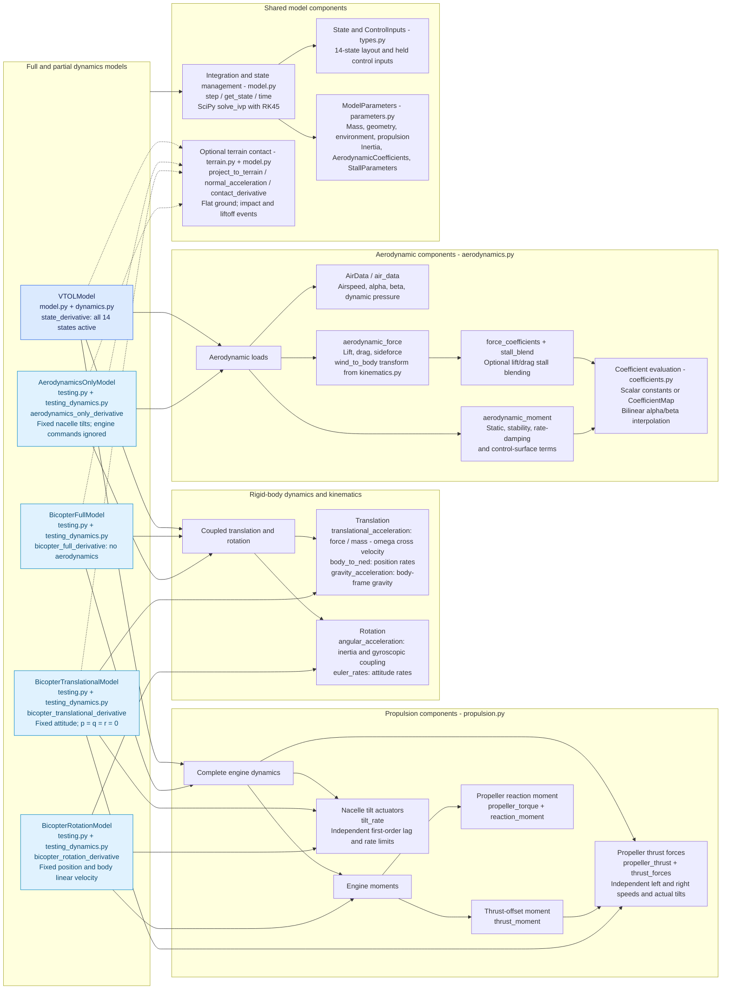

# VTOL dynamics structure

Arrows mean **uses or contains**, not execution order or inheritance. Dashed
arrows mark optional terrain contact. The four partial models inherit the
integration and state-management implementation from `VTOLModel`, but select
their own derivatives in `testing_dynamics.py`.

The motion functions are defined in `dynamics.py` and `kinematics.py`.
`VTOLModel` assembles force and moment components through `calculate_loads`
and `Loads`; the partial derivatives compose only their enabled physics.
Terrain contact is unavailable in `BicopterRotationModel`.
